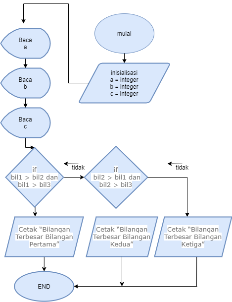
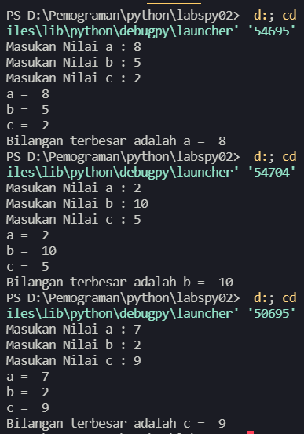

# **program sederhana dengan input tiga buah bilangan, dan menampilkan bilangan terbesarnya.**

## **Algoritma Program**

Diketahui 3 buah bilangan bil1,bil2,bil3, akan dicari nilai yang terbesar.

1. Mulai
2. Inisiasi bil1,bil2,bil3 sebagai integer.
3. Baca bil1.
4. Baca bil2.
5. Baca bil3.
6. Jika bil1 > bil2 dan bil1 > bil3 maka
7. kerjakan langkah 8, selain itu
8. Jika bil2 > bil1 dan bil2 > bil3 maka
9. kerjakan langkah 9, selain itu kerjakan langkah 10.
10. Cetak “Bilangan Terbesar Bilangan Pertama”.
11. Cetak “Bilangan Terbesar Bilangan Kedua”.
12. Cetak “Bilangan Terbesar Bilangan Ketiga”.
13. Selesai

## **Flowchart**

## **Screenshot Output Program 3 input**

